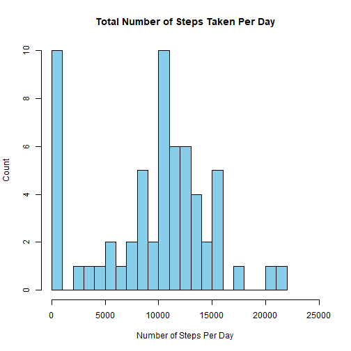
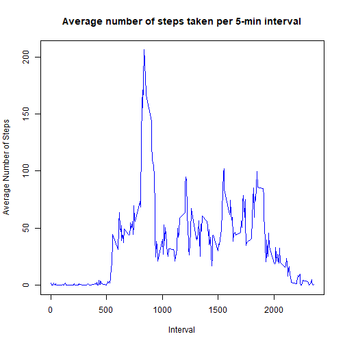
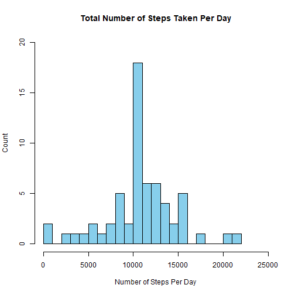
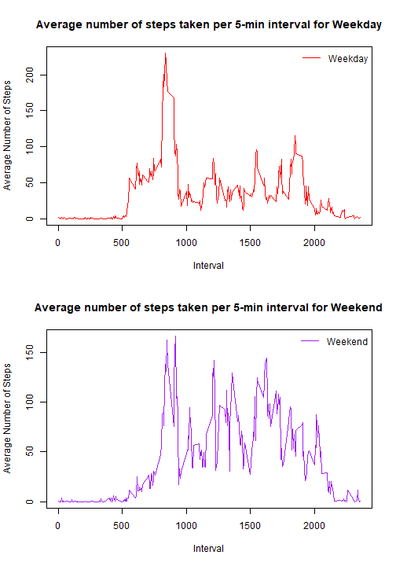

# Reproducible Research: Peer Assessment 1

## Introduction
This assignment makes use of data from a personal activity monitoring device.
The device collects data at 5 minute intervals through out the day. 
The data consists of two months of data from an anonymous individual collected during the months of October and November, 2012 and include the number of steps taken in 5 minute intervals each day.


## A Note For The Readers
This code runs on the assumption that the Github Respository given in the question is forked and pulled to the local directory. 
Please make sure that this is done before. Else click on the link below to fork the directory: [GitHub repository for this assignment](http://github.com/rdpeng/RepData_PeerAssessment1)


## Loading and preprocessing the data
Before proceeding further, we need to unzip and extract the data from the zip file. The following R code checks if the dataset exists in the directory or not. If the unzipped folder doesn't exist, it extracts the data from the zip folder.


```r
if (file.exists("activity.csv")) {
  message("Data file (in csv format) exists, skipping extraction \r")
} else {
  message("Extracting data \r")
  unzip(zipfile="activity.zip")  
}
```

```
## Data file (in csv format) exists, skipping extraction 
```

After extracting the file, the following R code reads the dataset and converts *date* and *interval* columns into suitable data classes.


```r
activity <- read.csv("activity.csv", header = TRUE)
activity$date <- as.Date(activity$date,format="%Y-%m-%d")
```


## What is mean total number of steps taken per day?
In this part of the assignment, we calculate the *mean* and *median* of the total number of steps taken per day. Along with it, we also *plot a histogram* showing the total number of steps taken each day. The histogram generated by the R code is shown below:


```r
# Converting from dataframe to datatable format
sum_by_day <- data.table::data.table(activity)

sum_by_day <- sum_by_day[, sum(steps, na.rm = TRUE), date]
colnames(sum_by_day) <- c("Date","Steps")

meansum_by_day <- mean(sum_by_day$Steps)
mediansum_by_day <- median(sum_by_day$Steps)

hist(sum_by_day$Steps, breaks = 20,
     xlab = "Number of Steps Per Day",
     ylab = "Count",
     main = "Total Number of Steps Taken Per Day",
     col = "skyblue", xlim = c(0, 25000))
```



The **mean** of the the total number of steps taken per day is **9354.2295082**.  
The **median** of the the total number of steps taken per day is **10395**.  


## What is the average daily activity pattern?
This part of the assignment the raw data is aggreated by intervals and for each interval, the mean of number of steps taken are calculated across days.  
Below shown is a time series plot of the average daily pattern of the number of steps plotted against the interval number:


```r
# Converting from dataframe to datatable format
sum_by_interval <- data.table::data.table(activity)

sum_by_interval <- sum_by_interval[, mean(steps, na.rm =  TRUE), interval]
colnames(sum_by_interval) <- c("Interval", "Steps")

maxsum_by_interval <- as.numeric(sum_by_interval[ which.max(sum_by_interval$Steps), 1])

plot(x = sum_by_interval$Interval, 
     y = sum_by_interval$Steps, 
     type = "l", col = "blue", 
     xlab = "Interval",
     ylab = "Average Number of Steps",
     main = "Average number of steps taken per 5-min interval")
```



The interval **835** contains the maximum number of steps averaged across all the days in the dataset.  


## Imputing missing values
This section of the assignment focuses on imputing the missing values in the raw dataset.  
To populate missing values, we choose to replace them with the mean value at the same interval across days. The choice is based on the assumption that activities usually follow a daily pattern.  
A histogram similar to Part - 1 is then generated to show the distrubution of the total number of steps taken each day for the imputed data.


```r
# Calculating the number of NA rows
no_of_NArows <- sum(is.na(activity$steps))

# Imputing dataset 
imputedData <- activity

# Replacing the missing values with the mean for that 5-minute interval across days
for (i in which(is.na(activity$steps))) {
  imputedData$steps[i] <- sum_by_interval$Steps[which(sum_by_interval$Interval == imputedData$interval[i])]
}

# Reperforming First Part of Assignment for the Imputed Data
sum_by_day2 <- data.table::data.table(imputedData)

sum_by_day2 <- sum_by_day2[, sum(steps, na.rm = TRUE), date]
colnames(sum_by_day2) <- c("Date","Steps")

meansum_by_day2 <- signif(mean(sum_by_day2$Steps), digits = 8)
mediansum_by_day2 <- signif(median(sum_by_day2$Steps), digits = 8)

hist(sum_by_day2$Steps, breaks = 20,
     xlab = "Number of Steps Per Day",
     ylab = "Count",
     main = "Total Number of Steps Taken Per Day",
     col = "skyblue", xlim = c(0, 25000), ylim = c(0,20))
```



The total number of missing values in the dataset is **2304**. They are replaced with the mean for that 5-minute interval across days.  
For this new *Imputed Dataset*, the **mean** of total number of steps taken per day is **1.0766189 &times; 10<sup>4</sup>**.  
Also, the **median** of total number of steps taken per day is **1.0766189 &times; 10<sup>4</sup>**.  
Comparing with the calculations done in the first section of this document, we observe that both mean and median has increased after data imputing.  


## Are there differences in activity patterns between weekdays and weekends?
In this section of the assignment , the imputed data is subsetted into 2 groups (weekends and weekdays) by the date when the data was collected.   
A panel plot is generated to show the activity pattern (in form of time series plot) for weekdays and weekends. The plot is shown below:  


```r
imputedData$Group <- weekdays(imputedData$date)

for (i in 1:length(imputedData$Group)) {
  if (imputedData$Group[i] %in% c("Saturday", "Sunday")) {
    imputedData$Group[i] <- "Weekend"
  } else {
    imputedData$Group[i] <- "Weekday"
  }
}

# Subsetting Weekend and Weekday Datasets
weekday_data <- data.table::data.table(subset(imputedData, Group == "Weekday"))
weekday_data <- weekday_data[, mean(steps, na.rm =  TRUE), interval]
colnames(weekday_data) <- c("Interval", "Steps")

weekend_data <- data.table::data.table(subset(imputedData, Group == "Weekend"))
weekend_data <- weekend_data[, mean(steps, na.rm =  TRUE), interval]
colnames(weekend_data) <- c("Interval", "Steps")

# Plotting the Datasets
par(mfrow = c(2, 1))

plot(x = weekday_data$Interval, 
     y = weekday_data$Steps, 
     type = "l", col = "red",
     xlab = "Interval",
     ylab = "Average Number of Steps",
     main = "Average number of steps taken per 5-min interval for Weekday")
legend("topright",  legend = "Weekday", lty = "solid", col = "red", bty = "n")

plot(x = weekend_data$Interval, 
     y = weekend_data$Steps, 
     type = "l", col = "purple", 
     xlab = "Interval",
     ylab = "Average Number of Steps",
     main = "Average number of steps taken per 5-min interval for Weekend")
legend("topright", legend = "Weekend", lty = "solid", col = "purple", bty = "n")
```



